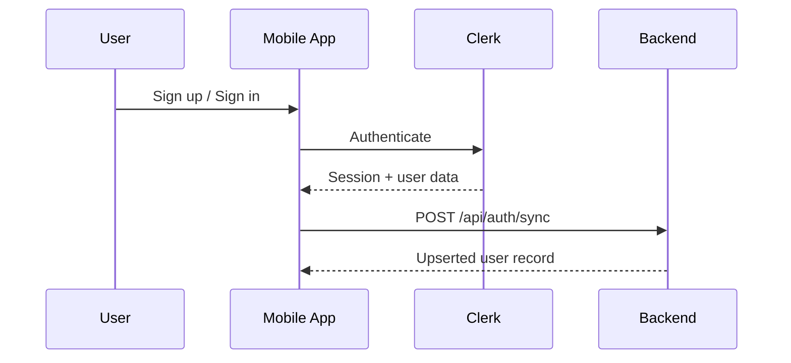

# Clerk Authentication and Backend Sync

## Purpose

This document describes how the mobile app signs users up and signs users in with Clerk, and what data the backend should expect when a user session becomes available.

It is intended to be the source of truth for backend user sync and account creation.

---

## High-level flow

1. The app initializes `ClerkProvider` with the publishable key and secure token storage.
2. The user signs up or signs in with Clerk.
3. When Clerk returns an active session, the app syncs the Clerk user to the backend.
4. The backend should **upsert** the user using the Clerk user ID as the unique key.

---

## Clerk setup in the app

- `ClerkProvider` is configured in [app/_layout.tsx](app/_layout.tsx#L1).
- Tokens are persisted with `expo-secure-store` in [lib/auth.ts](lib/auth.ts#L1).
- The app redirects unauthenticated users to the sign-in screen from [app/index.tsx](app/index.tsx#L1).

---

## Sign-up flow

### Screen

Implemented in [app/(auth)/sign-up.tsx](app/(auth)/sign-up.tsx#L1).

### Steps

1. The user enters:
   - name
   - email
   - password
2. The app calls `signUp.create()` with email and password.
3. The app calls `signUp.prepareEmailAddressVerification({ strategy: "email_code" })`.
4. The user enters the verification code.
5. The app calls `signUp.attemptEmailAddressVerification({ code })`.
6. When verification is complete:
   - the Clerk session is activated with `setActive({ session })`
   - the user is synced to the backend

### Payload sent after successful sign-up

The app sends:

```json
{
  "name": "John Doe",
  "email": "user@example.com",
  "clerkId": "user_2abc123xyz456def"
}
```

### Important notes

- The current app uses `completeSignUp.createdUserId` as the Clerk identifier.
- The sign-up flow is email-verification based.
- `name` comes from the form, not from Clerk.

---

## Sign-in flow

### Screen

Implemented in [app/(auth)/sign-in.tsx](app/(auth)/sign-in.tsx#L1).

### Steps

1. The user enters email and password.
2. The app calls `signIn.create()` with `identifier` and `password`.
3. If the sign-in is complete:
   - the Clerk session is activated with `setActive({ session })`
   - the app navigates to the authenticated area
4. If a second factor is required:
   - the app prepares email-code verification
   - the user enters the code
   - the app calls `signIn.attemptSecondFactor()`
   - on success, the session is activated

### Backend sync behavior after sign-in

The sign-in screen does **not** directly sync the user.
Instead, the authenticated home screen performs the sync once `useUser()` resolves.

That logic is in [app/(root)/(tabs)/home.tsx](app/(root)/(tabs)/home.tsx#L1).

### Payload sent after sign-in

The app sends:

```json
{
  "clerk_user_id": "user_2abc123xyz456def",
  "email": "user@example.com",
  "name": "John Doe"
}
```

The name is derived from:

1. `user.fullName`
2. `firstName + lastName`
3. email prefix
4. `"Unknown"`

---

## Google OAuth flow

### Screen

Implemented through [components/OAuth.tsx](components/OAuth.tsx#L1) and [lib/auth.ts](lib/auth.ts#L1).

### Steps

1. The user taps Google sign-in.
2. Clerk starts the OAuth flow.
3. When a session is created, the app activates it.
4. If a Clerk user was created during the flow, the app creates/syncs the backend user record.

### Payload sent for Google OAuth

```json
{
  "name": "John Doe",
  "email": "user@example.com",
  "clerkId": "user_2abc123xyz456def"
}
```

---

## Backend sync contract

### Canonical endpoint

The backend should expose:

`POST /api/auth/sync`

### Recommended request body

```json
{
  "clerk_user_id": "user_2abc123xyz456def",
  "email": "user@example.com",
  "name": "John Doe"
}
```

### Required fields

| Field | Type | Required | Notes |
|---|---|---:|---|
| `clerk_user_id` | string | Yes | Stable Clerk user identifier. Use as the unique key. |
| `email` | string | Yes | Primary email from Clerk. |
| `name` | string | No | Display name. Can be null or empty. |

### Expected backend behavior

- Treat the operation as an **upsert**.
- If the user exists, update `email` and `name`.
- If the user does not exist, create a new user row.
- The backend should return the stored user record.

### Recommended database rule

Make `clerk_user_id` unique.

---

## Current app-to-backend routing

There are two client-side sync patterns in the app today:

1. **Home screen sync**
   - Posts directly to `/api/auth/sync`
   - Uses `clerk_user_id`

2. **Sign-up / OAuth legacy sync route**
   - Posts to the local app route `/api/user`
   - Uses `clerkId`

### Backend recommendation

Standardize on **one** payload shape and one endpoint:

```json
{
  "clerk_user_id": "user_2abc123xyz456def",
  "email": "user@example.com",
  "name": "John Doe"
}
```

If the backend must support the legacy client path, accept `clerkId` as an alias for `clerk_user_id`.

---

## Sequence diagram



---

## Practical backend checklist

- Accept `clerk_user_id`, `email`, `name`
- Optionally accept `clerkId` for backward compatibility
- Validate `email` and Clerk user ID
- Perform an idempotent upsert
- Store the Clerk user ID as the stable external identifier
- Return the user record after sync

---

## Source files

- [app/_layout.tsx](app/_layout.tsx)
- [app/index.tsx](app/index.tsx)
- [app/(auth)/sign-in.tsx](app/(auth)/sign-in.tsx)
- [app/(auth)/sign-up.tsx](app/(auth)/sign-up.tsx)
- [app/(root)/(tabs)/home.tsx](app/(root)/(tabs)/home.tsx)
- [app/(api)/user+api.ts](app/(api)/user+api.ts)
- [app/(api)/auth/sync+api.ts](app/(api)/auth/sync+api.ts)
- [lib/auth.ts](lib/auth.ts)
- [components/OAuth.tsx](components/OAuth.tsx)
